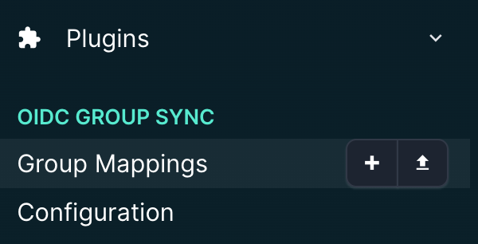
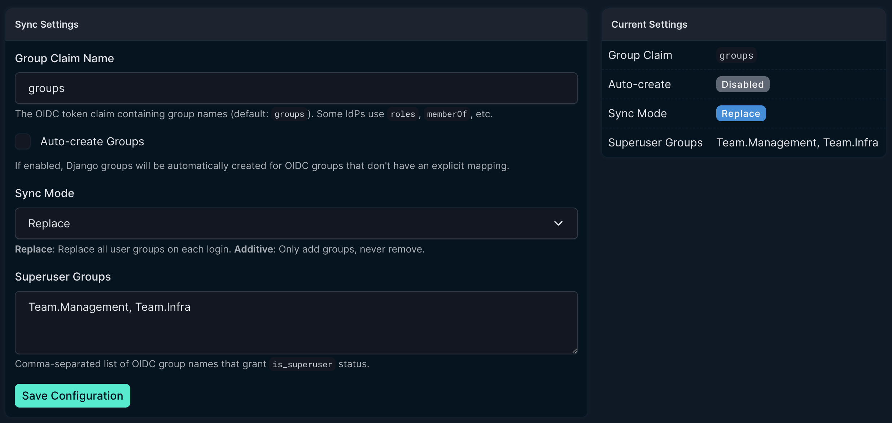
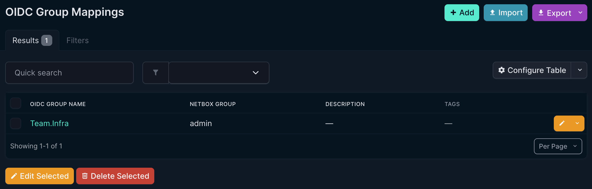
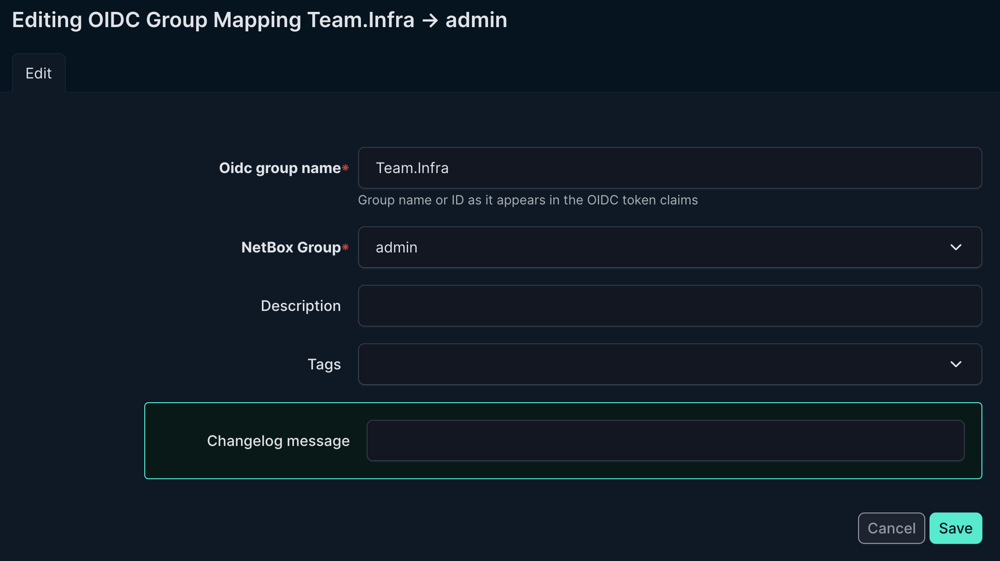
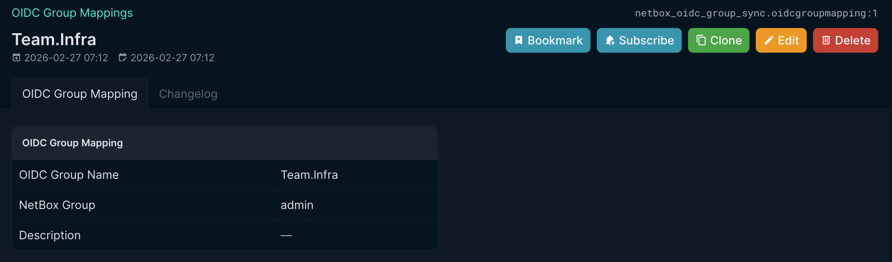

# NetBox OIDC Group Sync


A NetBox plugin that synchronizes OIDC/OAuth2 identity provider groups to NetBox (Django) groups via a configurable mapping table. Works with **Okta**, **Azure AD/Entra ID**, **Google Workspace**, **Keycloak**, **Auth0**, and any standards-compliant OIDC provider.

## Features

- **UI-configurable mapping** of OIDC groups → NetBox groups
- **Replace or additive** sync modes
- **Auto-creation** of NetBox groups from OIDC claims
- **Superuser flag assignment** based on OIDC group membership
- **Bulk import/export** of mappings
- **REST API** for programmatic management
- **Full change logging** (NetBox's built-in audit trail)

## GUI Usage

The plugin adds an **OIDC Group Sync** section to the NetBox plugins menu:



### Configuration

Navigate to **Plugins → OIDC Group Sync → Configuration** to set the global sync mode, group claim name, superuser group names, and auto-creation preferences.



### Group Mappings

Navigate to **Plugins → OIDC Group Sync → Group Mappings** to view all OIDC-to-NetBox group mappings:



Use the add/edit form to create or modify a mapping entry:



Each mapping entry can be viewed in read-only detail:



## Requirements

| Requirement | Version |
|---|---|
| NetBox | 4.0+ (tested on **4.5.3** only — likely works on older 4.x but untested) |
| Python | 3.10+ |
| `python-social-auth` | Included with NetBox |

## Installation

### 1. Install the package

```bash
cd /opt/netbox
source venv/bin/activate
pip install /path/to/netbox-oidc-group-sync/
```

### 2. Configure `configuration.py`

Add the plugin, your OIDC provider settings, and the social auth pipeline to `configuration.py`. This example uses Okta — see [IdP Configuration Guides](#idp-configuration-guides) below for other providers.

```python
# --- Plugin ---
PLUGINS = [
    'netbox_oidc_group_sync',
]

# --- OIDC Provider (Okta example) ---
REMOTE_AUTH_BACKEND = 'social_core.backends.okta_openidconnect.OktaOpenIdConnect'
SOCIAL_AUTH_OKTA_OPENIDCONNECT_KEY = 'your-okta-client-id'
SOCIAL_AUTH_OKTA_OPENIDCONNECT_SECRET = 'your-okta-client-secret'
SOCIAL_AUTH_OKTA_OPENIDCONNECT_API_URL = 'https://your-org.okta.com/oauth2/'
SOCIAL_AUTH_OKTA_OPENIDCONNECT_SCOPE = ['openid', 'profile', 'email', 'groups']

# --- Social Auth Pipeline (REQUIRED for group sync) ---
SOCIAL_AUTH_PIPELINE = (
    'social_core.pipeline.social_auth.social_details',
    'social_core.pipeline.social_auth.social_uid',
    'social_core.pipeline.social_auth.auth_allowed',
    'social_core.pipeline.social_auth.social_user',
    'social_core.pipeline.user.get_username',
    'social_core.pipeline.user.create_user',
    'social_core.pipeline.social_auth.associate_user',
    'netbox_oidc_group_sync.pipeline.sync_oidc_groups',   # <-- OIDC Group Sync
    'social_core.pipeline.social_auth.load_extra_data',
    'social_core.pipeline.user.user_details',
)
```

> **⚠️** The `sync_oidc_groups` pipeline step is **required**. Without it, the plugin will be installed but group sync will never execute during login. It must be placed **after** `associate_user` so the Django User object exists before group membership is synchronized.

> **Note:** The `SOCIAL_AUTH_` prefix varies by backend. For the Okta-specific backend, use `SOCIAL_AUTH_OKTA_OPENIDCONNECT_*`. For the generic OIDC backend, use `SOCIAL_AUTH_OIDC_*`. The pipeline configuration is the same for all backends.

### 3. Run database migrations

```bash
cd /opt/netbox/netbox
python manage.py migrate netbox_oidc_group_sync
```

Expected output on first run:

```
Operations to perform:
  Apply all migrations: netbox_oidc_group_sync
Running migrations:
  Applying netbox_oidc_group_sync.0001_initial... OK
```

### 4. Restart NetBox

```bash
sudo systemctl restart netbox netbox-rq
```

## IdP Configuration Guides

### Okta Setup

1. In the Okta Admin Console, go to **Applications → your NetBox app → Sign On → OpenID Connect ID Token**
2. Add a "Groups" claim:
   - **Name:** `groups`
   - **Include in:** ID Token (Always)
   - **Value type:** Filter
   - **Filter:** Matches regex `.*` (or a specific pattern to limit groups)
3. In the NetBox plugin config, set `group_claim_name` to `groups`
4. **Note:** Okta sends group names as strings (e.g., `"NetBox Admins"`, `"DNS Operators"`)

Example Okta OIDC token groups claim:

```json
{
  "groups": ["Everyone", "NetBox Admins", "DNS Operators", "NOC Staff"]
}
```

The [installation example](#2-configure-configurationpy) above uses the **Okta-specific backend** (`OktaOpenIdConnect`) with the `SOCIAL_AUTH_OKTA_OPENIDCONNECT_*` prefix. Alternatively, you can use the **generic OIDC backend** with Okta:

```python
REMOTE_AUTH_BACKEND = 'social_core.backends.open_id_connect.OpenIdConnectAuth'
SOCIAL_AUTH_OIDC_OIDC_ENDPOINT = 'https://your-org.okta.com'
SOCIAL_AUTH_OIDC_KEY = 'your-client-id'
SOCIAL_AUTH_OIDC_SECRET = 'your-client-secret'
SOCIAL_AUTH_OIDC_SCOPE = ['openid', 'profile', 'email', 'groups']
```

### Azure AD / Entra ID Setup

1. In **Azure Portal → App registrations → your app → Token configuration**
2. Add optional claim → ID token → `groups`
3. Or use `Group.Read.All` permission and set the claim to emit group display names
4. **Important:** Azure AD sends group Object IDs by default. To get group names instead, enable `emit_as_names` or configure the optional claim accordingly
5. Set `group_claim_name` to `groups` (default) or `roles` if using App Roles

Example with group names:

```json
{
  "groups": ["sg-netbox-admins", "sg-netbox-readonly"]
}
```

### Google Workspace Setup

1. Google OIDC doesn't natively include groups in tokens
2. Use **Google Workspace Admin SDK** or a custom middleware
3. Alternatively, use the **Google Cloud Identity Groups API**
4. Consider using `memberOf` claim if available through a proxy/gateway

### Keycloak Setup

1. In **Keycloak Admin → Clients → your client → Client scopes → add mapper**
2. Mapper type: **Group Membership**
3. Token claim name: `groups`
4. Full group path: **OFF** (unless you want `/parent/child` format)
5. Set `group_claim_name` to `groups`

### Auth0 Setup

1. Use **Auth0 Rules or Actions** to add groups to the ID token
2. Example Auth0 Action (Post Login):

```javascript
exports.onExecutePostLogin = async (event, api) => {
  const namespace = 'https://netbox.example.com/';
  if (event.authorization) {
    api.idToken.setCustomClaim(`${namespace}groups`, event.authorization.roles);
  }
};
```

3. Set `group_claim_name` to `https://netbox.example.com/groups`

## Usage

### Bulk Import

Use the import button to upload CSV mappings:

```csv
oidc_group_name,group,description
"NetBox Admins",netbox-admins,"Full NetBox admin access"
"DNS Operators",dns-operators,"DNS management team"
"NOC Staff",noc-readonly,"Read-only NOC access"
```

### 4. Superuser Flag Mapping

> **This is separate from group membership.** Group Mappings control which NetBox groups a user belongs to. Superuser mapping controls Django's built-in `is_superuser` permission flag.
>
> **Note:** NetBox 4.x removed `is_staff` from its User model entirely, so only `is_superuser` is supported.

In **Configuration**, add OIDC group names to the **Superuser Groups** field (comma-separated). When a user logs in via OIDC:

| Config Field | What happens on login |
|---|---|
| **Superuser Groups** | If the user's OIDC token contains **any** of these group names → `is_superuser = True` (full admin access). Otherwise → `is_superuser = False`. |

**Example:** If Okta sends `groups: ["IT-Admins", "Network-Ops"]` and you set **Superuser Groups** to `IT-Admins`, that user becomes a Django superuser on every login. If they're later removed from `IT-Admins` in Okta, they lose superuser on next login.

Leave this field empty to skip superuser management entirely (the plugin won't touch that flag).

## REST API

The plugin provides a REST API under `/api/plugins/oidc-group-sync/`:

| Endpoint | Methods | Description |
|---|---|---|
| `/api/plugins/oidc-group-sync/mappings/` | GET, POST | List/create mappings |
| `/api/plugins/oidc-group-sync/mappings/{id}/` | GET, PUT, PATCH, DELETE | Retrieve/update/delete a mapping |
| `/api/plugins/oidc-group-sync/config/` | GET, PUT, PATCH | View/update singleton config |

### Examples

```bash
# List all mappings
curl -H "Authorization: Token $NETBOX_TOKEN" \
  https://netbox.example.com/api/plugins/oidc-group-sync/mappings/

# Create a mapping
curl -X POST -H "Authorization: Token $NETBOX_TOKEN" \
  -H "Content-Type: application/json" \
  -d '{"oidc_group_name": "NetBox Admins", "group_id": 1}' \
  https://netbox.example.com/api/plugins/oidc-group-sync/mappings/
```

## Sync Mode Behavior

| Mode | On Login | Description |
|---|---|---|
| **Replace** | User's NetBox groups are completely replaced with the mapped OIDC groups | Clean state on every login. If user's OIDC groups change in the IdP, NetBox reflects it immediately. |
| **Additive** | OIDC-mapped groups are added to user's existing groups | Groups are never removed. Manual group assignments persist. |

## Debug Logging

The plugin emits detailed diagnostic logs during the OIDC pipeline. To enable debug output, add this to your `configuration.py`:

```python
LOGGING = {
    'version': 1,
    'disable_existing_loggers': False,
    'handlers': {
        'console': {'class': 'logging.StreamHandler'},
    },
    'loggers': {
        'netbox_oidc_group_sync': {
            'handlers': ['console'],
            'level': 'DEBUG',
        },
    },
}
```

This logs every step of the pipeline — response keys, claim extraction attempts, group mapping results, and superuser flag changes. Output goes to the NetBox systemd journal (`journalctl -u netbox`).

## Troubleshooting

### 1. Groups not syncing

Check that `netbox_oidc_group_sync.pipeline.sync_oidc_groups` is in your `SOCIAL_AUTH_PIPELINE` **after** `associate_user`. Without the pipeline function, group sync never executes.

### 2. Claim not found

Verify `group_claim_name` matches your IdP's token claim exactly. Enable [debug logging](#debug-logging) to see what claims are arriving.

### 3. Okta groups empty

Ensure the Groups claim is configured in the OIDC app's **Sign On** settings and that the OIDC scope includes `groups`.

### 4. Azure AD shows Object IDs instead of names

Configure the optional claim to emit group display names, or map the Object IDs directly in the plugin's mapping table.

### 5. User loses all groups on login

This is expected behavior in **Replace** mode if no OIDC groups are mapped. Either switch to **Additive** mode or create mappings for all relevant OIDC groups first.

### 6. Auto-created groups have no permissions

Auto-create only creates the NetBox group object. You must assign permissions separately in **NetBox Admin → Groups**.

## Development

See **[README_DEV.md](README_DEV.md)** for the full developer guide, including:
- Edit → deploy → test cycle
- Pip caching gotchas
- Full database wipe & reinstall procedure
- Migration development notes
- Complete uninstall instructions

Quick start:

```bash
# Clone the repo
git clone https://github.com/hrdflt/netbox-oidc-group-sync.git
cd netbox-oidc-group-sync

# Install (--no-cache-dir is critical during development!)
pip install --no-cache-dir --force-reinstall .

# Run migrations
cd /opt/netbox/netbox
python manage.py migrate netbox_oidc_group_sync
```

## License

Apache License 2.0 — see [LICENSE](LICENSE) file.
